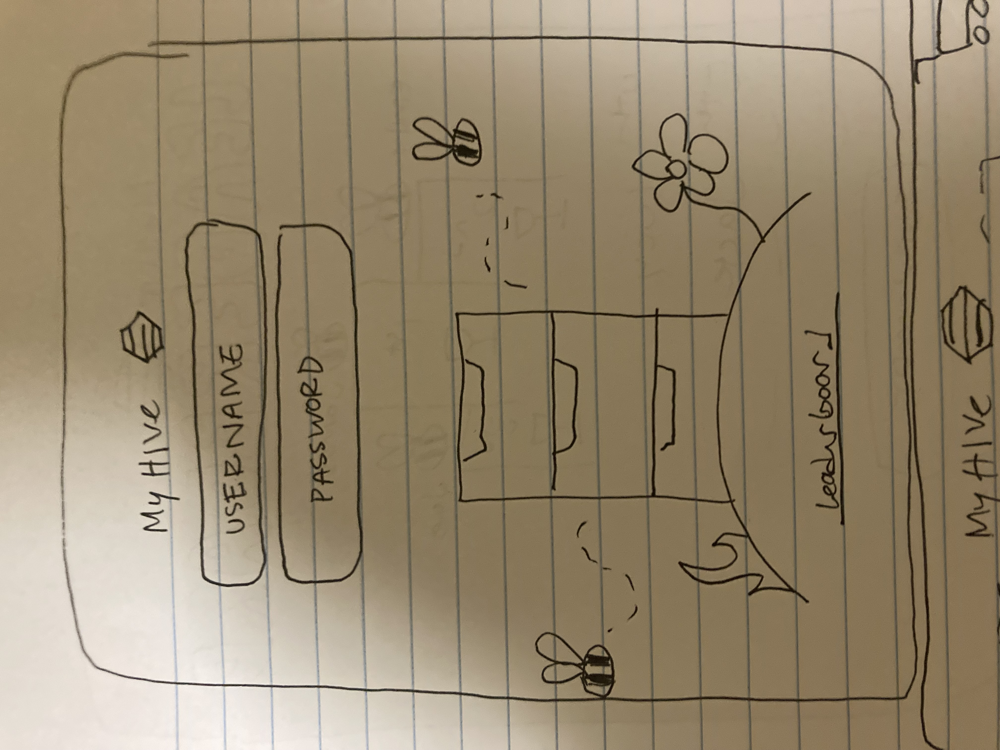
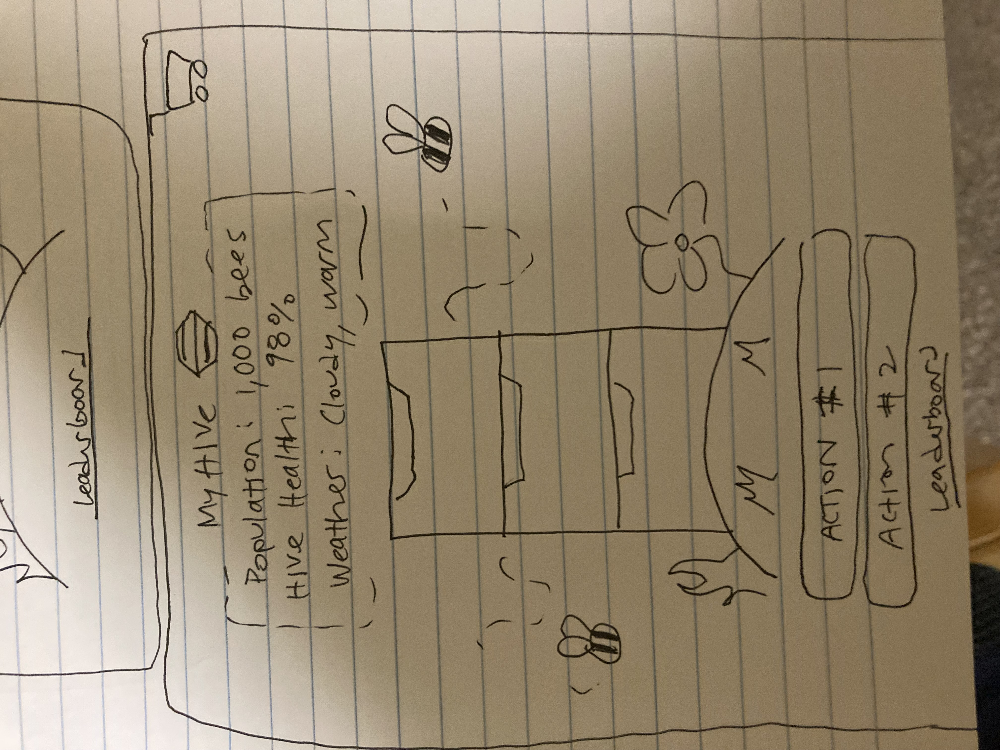
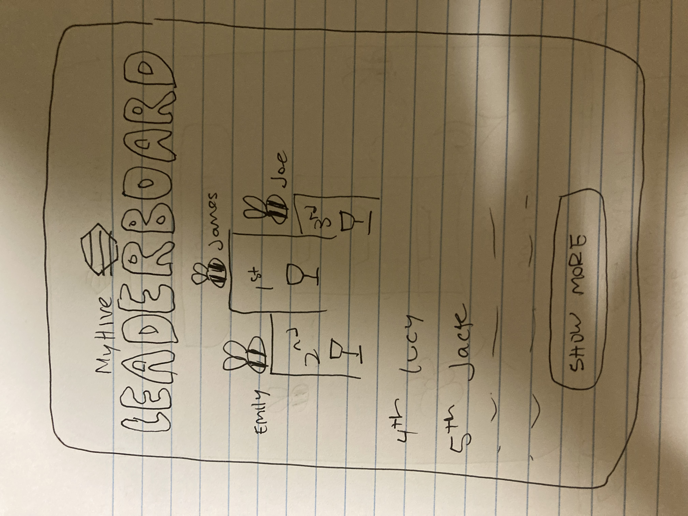

# James' Startup
Hello! This is my startup read me where I will be recording my entire journey!

## Specification Deliverable
### Elevator Pitch
Bees are awesome! Not only are they essential to our environment, but they’re a fascinating species that most of us don’t know that much about. While it would be awesome if we all could be beekeepers, time and space are an issue for so many people, especially busy college students—but no longer! MyHive is an online startup that allows anyone to start their own hive, produce honey, and compete against other players—all while learning more about bees on this educational platform. Built to be as realistic as possible, MyHive is not only fun but it also spreads the joy of beekeeping with the world! 
### Design
This is my design for the login page. It will look very similar to the home page, but won't be able to display personal information.

This is my main page that looks a lot like the login page. The action items are buttons you can press to perform an action around the hive. I plan to make this highly education and as accurate as possible. I will probably meet with a beekeeper to discuss what these actions should be to give the user the most accurate experience.

This is my leaderboard page which shows the top ten spots, decided by who has collected the most honey.

### Key Features

- Secure login over HTTPS
- View realtime date from your beehive and other players
- Ability to preform different actions that affect your hive population and health
- Display beehive animation
- Display total amount of bees, their health
- Ability to view leaderboard with real time data from other players

### Technologies
Here is how I'm going to use the required technologies:

- **HTML** - Correct use of common HTML best practices. Include three pages-- one for login, the main home screen, and the leaderboard. The leaderboard is included as a link on the home screen. Use html to add in images and designs that I build in Adobe illustrator.
- **CSS** - Styling that looks good no matter what device you are on. Impliment CSS best practices. CSS adds color and styling that makes the website feel good and look professional. 
- **JavaScript** - Handles login, and each action that the user can do to take care of the beehive. Also in charge of backend endpoint calls to handle how each action will affect population and health of the hive.
- **Service** - Backend service with endpoints for:
  - login
  - retrieving actions from the home page
  - submitting changes to hive data
- **Authentication** - Have a login page including username and password. This is authenticated by the database and then redirects the user to their personalized home screen with their hive data. 
- **DB/Login** - Stores user data which includes username, password, hive population, and hive health. Handles login information and controls leaderboard.
- **WebSocket** - As hive data changes, the leaderboard is constantly being updated. Each action will also change the hive population and health, which will reflect real time to the user and on the leaderboard.
- **React** - Application ported to use the React web framework. (for transparency this is the same as the example project)

## HTML Deliverable
For this deliverable, I created the framework for my website with HTML.

- **HTML Pages** - Four HTML pages (index, play, scoreboard, about). These give the ability to login, play the MyHive game, view how many people are online, view the leaderboard, and learn more about how MyHive works. These all follow the proper rules of BODY, NAV, MAIN, HEADER, and FOOTER.
- **Links** - When you login, it redirects you to the play page. At the top of every page, there is a navigation link system that takes you to any page you want (except login, which you don't need after you login)
- **Text** - Text is represented on every page and lets the user know what's going on. This includes text to describe the buttons and login, as well as helpful tips on the about page, or users scores.
- **Images** - I include images on the index, play, and scoreboard pages. These are logos and a podium graphic that contribute to the user experience. All pages have a favicon logo.
- **DB/Login** - User provides their username and password to login. Based on that, they are redirect to their own personal play page. The database also helps update the leaderboard page.
- **WebSocket** - On the scoreboard page, it shows real time how many people are on the site. It also shows their real time score which is constantly being updated. Additionally, on the play page, the user's data is constantly being updated to reflect their score.

## CSS Deliverable
For this deliverable, I created the design for my website using CSS, specifically style.css
NOTE TO GRADER: I had this really cool idea I wanted to pursue just a couple days ago. I felt confident in my ability to catch up, so I was given permission to change my project on Monday morning. I know it hasn't been much time since then, but I feel excited and confident about my new project. I'm in the process of updating the rest of this document with the new information for my new idea, feel free to reach out to me with any questions!

- **Header, footer, and main content body** - It all looks great, and each element has it's own style. They are designed in a way that makes it easy for a user to understand and use.
- **Navigation elements** - Instead of using the basic list and link elements, I dropped the list bullets and underlines, and added a stunning orange border around the pages that contrasts nicely with the rest o the page. They're all line up on the left side of the page which adds a nice design element. I also added the website logo and am having that function as the home link.
- **Responsive to window resizing** - Website looks great and professional on all screen sizes.
- **Application elements** - All the elements have their unique style that blends in well with the flow of the design. This includes designs for inputs (text, radio buttons), text, buttons, links, and even added in some styling for cards with border shadow.
- **Application text content** - Consistent fonts, styled different types of text (h1, a, p, etc...)
- **Application images** - adjusted image sizes to fit with page, elements they are a part of. I used lots of different images on different pages, and even incorporated it into my header.

## JavaScript Deliverable
For this deliverable, I wrote some JavaScript that controls all the main functions of the website, making it completely functional for a single user. I also left placeholders for WebSocket and database queries that we will learn more about in the future.
NOTE TO GRADER: I'm still in the process of updating this document since changing my project idea, it should be fully updated by the end of this week. Been spending my time getting caught up. 

- **login/sign up** - When you press the login button it makes sure that the fields are complete and takes you to my home page. I also left a place in the function where I can check the database to make sure that they have valid credentials. I also added this for the sign-up pages, and added a javascript function to check to make sure their "start date" was before their "end date". It notifies the user if there are an errors that occured. I store this information and display it on the home page.
- **database** - While it's just dummy data right now, I created a function that loads the posts from the "database". This is on all pages of the home screen.
- **WebSocket** - I used the setInterval function to add new posts that are being created by "test users" every few seconds. When we get to our WebSocket unit, this will be replaced by people's realtime posts.
- **application logic** - I implimented a tab system using Javascript to navigate between different subjects on the same page. I also made it possible for the user to create their own post and add it to the stream of posts displayed on the home screen. It's also stored in a placeholder array. Eventually, this will be added to the database, but for now it is a mock representation of the data.
- **Third Party Call** - I left a javascript placeholder to grab the specific area from the account as well as a little snippet of the area. Right now, this is a hard coded string, but it will eventually fetch data about the area from a 3rd party source.
- **localstorage** - I was also able to save the username and password using the local memory API. I display this information, but in the future I would also like to display more information from the user such as their email/time of service/etc... Because it's not possible without a database, I left placeholders where I could to represent this technology.

## Service deliverable
For this deliverable I added backend endpoints that receives posts, returns all posts, and retrives posts. I use node.js and static middleware. I also call a 3rd party input to get information.

- **Node.js/Express HTTP service** - done!
- **Static middleware for frontend** - done!
- **Calls to third party endpoints** - I use the restcountries third party API to get information about the area. This will be displayed on the homescreen as soon as my placeholder for the backend can actually retrive information from the database.
- **Backend service endpoints** - Placeholders getting mission area, all posts, and login information. Endpoint implimented for making a post.
- **Frontend calls service endpoints** - I did this using the fetch function. The frontend calls the service endpoint when the user selects their mission area.
